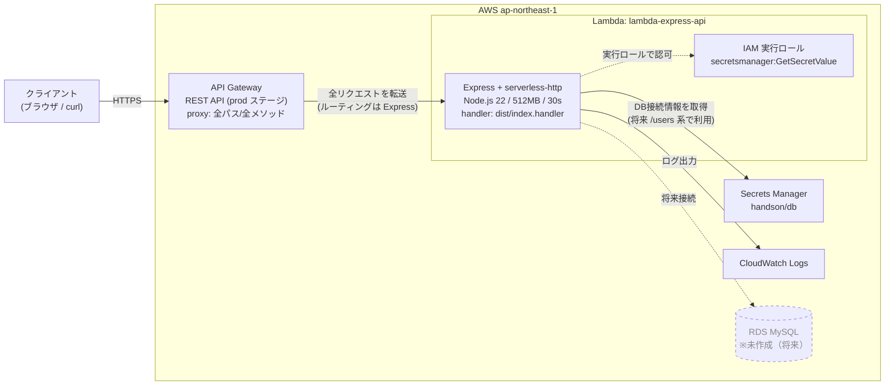

# AWS アーキテクチャ図 — lambda-express-api

CDK（`lib/lambda-express-api-stack.ts`）でデプロイした構成。
リージョン: **ap-northeast-1（東京）** / アカウント: **698031349306**

公開 URL: `https://kyhcoepvja.execute-api.ap-northeast-1.amazonaws.com/prod/`

---

## 構成図（Mermaid）



---

## リクエストの流れ

```
クライアント
   │  HTTPS GET /prod/health など
   ▼
API Gateway (REST, prod, proxy:true)
   │  全URL・全メソッドをそのまま Lambda へ
   ▼
Lambda (Express + serverless-http)
   │  Express がルーティング (/health, /users, /api-docs)
   ├─▶ Secrets Manager から DB情報取得（/users 系・将来）
   ├─▶ RDS MySQL へ接続（将来）
   └─▶ CloudWatch Logs へログ出力
```

---

## 各コンポーネント

| コンポーネント | 役割 | CDK 上の定義 | 状態 |
|----------------|------|--------------|------|
| **API Gateway** | HTTP の入口。`proxy: true` で全リクエストを Lambda に丸投げし、ルーティングは Express に任せる。ステージ `prod` | `apigateway.LambdaRestApi` | ✅ 稼働中 |
| **Lambda** | Express アプリ本体。`serverless-http` で Lambda 用に変換。Node22 / 512MB / 30秒 | `lambda.Function` | ✅ 稼働中 |
| **IAM 実行ロール** | Lambda に付与。Secrets Manager 読み取り＋基本実行権限 | `fn.addToRolePolicy(...)` | ✅ 稼働中 |
| **Secrets Manager** | DB 接続情報 `handson/db` を保持 | （既存リソースを参照） | ⚠️ シークレット未登録 |
| **CloudWatch Logs** | Lambda / API Gateway のログ | 自動作成 | ✅ 稼働中 |
| **RDS MySQL** | 永続データストア | 未定義 | ❌ 未作成（将来） |

---

## エンドポイント

| パス | 内容 | 状態 |
|------|------|------|
| `GET /prod/health` | ヘルスチェック → `{"status":"ok"}` | ✅ 動作確認済み |
| `GET /prod/api-docs` | Swagger UI（API ドキュメント） | ✅ 利用可 |
| `/prod/users` 系 | ユーザー CRUD | ⚠️ DB 未接続のため未稼働 |

---

## 未稼働部分について（/users 系）

現状 `/users` 系が動かない理由は2つ。`cdk/README.md` の「DB を繋ぐとき（将来）」に対応手順あり。

1. **RDS（MySQL）と Secrets Manager `handson/db` が未用意**
2. **`index.ts` の `fromIni({ profile: 'mvtk-refactoring' })` がローカル前提**
   → Lambda 上では実行ロール認証を使うよう、環境で分岐させる必要がある
   （RDS がプライベートサブネットなら Lambda も同 VPC に配置が必要）
