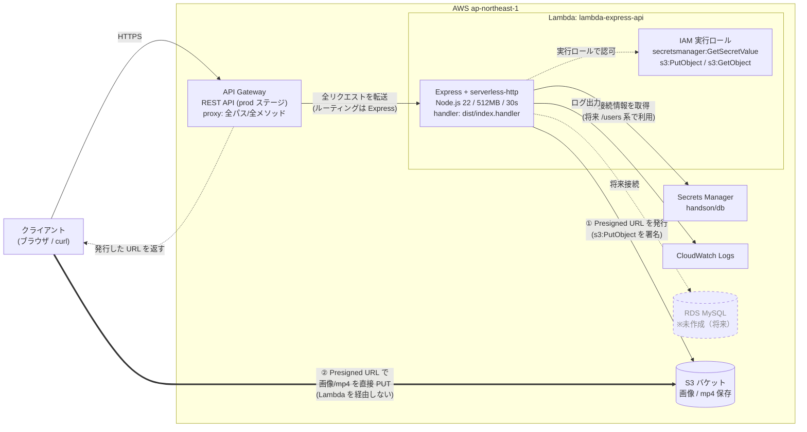

# AWS アーキテクチャ図 — lambda-express-api

CDK（`lib/lambda-express-api-stack.ts`）でデプロイした構成。
リージョン: **ap-northeast-1（東京）** / アカウント: **698031349306**

公開 URL: `https://kyhcoepvja.execute-api.ap-northeast-1.amazonaws.com/prod/`

---

## 構成図（Mermaid）



> ⚡ **画像 / mp4 の保存フロー**
> 1. クライアントが Lambda に「アップロード用 URL ください」とリクエスト（API Gateway 経由）。
> 2. Lambda が S3 に対する **Presigned URL（署名付き URL）** を発行して返す。
> 3. クライアントはその URL を使って **S3 へファイル本体を直接 PUT**（Lambda を経由しないので、Lambda のペイロード上限やタイムアウトの影響を受けない）。

---

## リクエストの流れ

```
クライアント
   │  HTTPS GET /prod/health など
   ▼
API Gateway (REST, prod, proxy:true)
   │  全URL・全メソッドをそのまま Lambda へ
   ▼
Lambda (Express + serverless-http)
   │  Express がルーティング (/health, /users, /api-docs, /uploads)
   ├─▶ Secrets Manager から DB情報取得（/users 系・将来）
   ├─▶ RDS MySQL へ接続（将来）
   ├─▶ S3 への Presigned URL を発行してクライアントに返す
   └─▶ CloudWatch Logs へログ出力

   ※ 画像/mp4 の本体は Lambda を通らず、
     クライアントが受け取った Presigned URL で S3 へ直接 PUT する。
```

---

## 各コンポーネント

| コンポーネント | 役割 | CDK 上の定義 | 状態 |
|----------------|------|--------------|------|
| **API Gateway** | HTTP の入口。`proxy: true` で全リクエストを Lambda に丸投げし、ルーティングは Express に任せる。ステージ `prod` | `apigateway.LambdaRestApi` | ✅ 稼働中 |
| **Lambda** | Express アプリ本体。`serverless-http` で Lambda 用に変換。Node22 / 512MB / 30秒 | `lambda.Function` | ✅ 稼働中 |
| **IAM 実行ロール** | Lambda に付与。Secrets Manager 読み取り＋S3 への署名（PutObject/GetObject）＋基本実行権限 | `fn.addToRolePolicy(...)` | ✅ 稼働中 |
| **Secrets Manager** | DB 接続情報 `handson/db` を保持 | （既存リソースを参照） | ⚠️ シークレット未登録 |
| **CloudWatch Logs** | Lambda / API Gateway のログ | 自動作成 | ✅ 稼働中 |
| **RDS MySQL** | 永続データストア | 未定義 | ❌ 未作成（将来） |
| **S3 バケット** | 画像 / mp4 の保存先。Lambda が発行した Presigned URL でクライアントが直接アップロード | CDK 管理外（GUI で別途作成・既存前提） | 🔧 GUI で用意 |

---

## エンドポイント

| パス | 内容 | 状態 |
|------|------|------|
| `GET /prod/health` | ヘルスチェック → `{"status":"ok"}` | ✅ 動作確認済み |
| `GET /prod/api-docs` | Swagger UI（API ドキュメント） | ✅ 利用可 |
| `/prod/users` 系 | ユーザー CRUD | ⚠️ DB 未接続のため未稼働 |

---

## 未稼働部分について（/users 系）

現状 `/users` 系が動かない理由は2つ。`cdk/README.md` の「DB を繋ぐとき（将来）」に対応手順あり。

1. **RDS（MySQL）と Secrets Manager `handson/db` が未用意**
2. **`index.ts` の `fromIni({ profile: 'mvtk-refactoring' })` がローカル前提**
   → Lambda 上では実行ロール認証を使うよう、環境で分岐させる必要がある
   （RDS がプライベートサブネットなら Lambda も同 VPC に配置が必要）

---

## 画像 / mp4 アップロード — Presigned URL 詳説

> 出典: [署名付き URL を使用したオブジェクトの共有（AWS 公式）](https://docs.aws.amazon.com/ja_jp/AmazonS3/latest/userguide/ShareObjectPreSignedURL.html)

S3 バケットは **この CDK の管理外**（GUI で別途作成する既存リソース前提）。
アプリは「発行する側」だけを担い、ファイル本体は通らない。

### Presigned URL（署名付き URL）とは

- デフォルトでは**非公開**な S3 オブジェクトに対して、**期限付き・一時的なアクセス権**を与えるセキュアな URL。
- URL を受け取った側は **AWS 認証情報を持たなくても**、その URL だけで対象オブジェクトに
  アップロード（PUT）またはダウンロード（GET）できる。
- URL には**発行者（Lambda の実行ロール）の権限が埋め込まれる**。
  → つまり「Lambda が持つ S3 権限の範囲」でしか操作できない。

### なぜこの構成にするのか（Lambda を経由しない理由）

- 画像・mp4 のような**大きいファイルを Lambda 本体に通さない**ため。
  - API Gateway / Lambda にはペイロードサイズ上限（API Gateway は 10MB）やタイムアウトがある。
  - 動画を Lambda 経由にすると、上限超過・メモリ圧迫・課金増になりやすい。
- Lambda は「**どこに・どの名前で・どれくらいの期限で**置いてよいか」を署名した URL を渡すだけ。
  実データ転送は **クライアント ⇄ S3 が直接**行う。

### 処理の流れ（再掲・詳細）

```
クライアント                Lambda (Express)            S3
   │                            │                        │
   │  ① POST /uploads           │                        │
   │   (filename, contentType)  │                        │
   │ ─────────────────────────▶ │                        │
   │                            │ ② PutObject 用に署名     │
   │                            │   (key/期限/型を指定)    │
   │   ③ Presigned URL を返す    │                        │
   │ ◀───────────────────────── │                        │
   │                                                     │
   │  ④ PUT <Presigned URL> に画像/mp4 を直接アップロード   │
   │ ──────────────────────────────────────────────────▶ │
   │                            ⑤ 200 OK（Lambda は不関与）│
```

ダウンロード（GET）も同様に、Lambda が `GetObject` 用の Presigned URL を発行し、
クライアントはその URL で直接取得する。

### 有効期限の上限（発行方法ごと）

| 発行方法 | 最大有効期限 |
|----------|--------------|
| S3 コンソール（GUI） | **12 時間** |
| AWS CLI（`aws s3 presign`） | **7 日間**（604,800 秒） |
| AWS SDK（コードで発行） | 任意に指定（既定は短め。用途に応じて秒で設定） |

> アップロード用途では**数分〜十数分程度の短い期限**が推奨。長くするほど URL 漏洩時のリスクが増す。

### セキュリティ上の注意

- **URL = 一時的な鍵**。漏れると有効期限内は誰でもアクセスできるため、信頼できる相手にのみ渡す。
- **期限は必要最小限**に。アップロードは短く、共有用ダウンロードでも長くしすぎない。
- URL には発行者の権限が乗るので、**Lambda 実行ロールの S3 権限は最小限**にする
  （`s3:PutObject` / 必要なら `s3:GetObject` を対象バケット/プレフィックスに限定）。
- ブラウザから直接 PUT するため、**S3 バケットの CORS 設定が必須**
  （許可オリジン・`PUT`/`GET` メソッド・必要なヘッダーを許可）。

### GUI で用意するもの（CDK 管理外）

1. **S3 バケット作成**（リージョン: ap-northeast-1）。
2. **CORS 設定**：フロントのオリジンから `PUT`/`GET` を許可。
3. **Lambda 実行ロールに S3 権限を付与**：対象バケットへ `s3:PutObject`（必要なら `s3:GetObject`）。
4. （任意）公開せず非公開のまま運用し、配信は Presigned URL か CloudFront を使う。

### 実装イメージ（AWS SDK v3・発行はコードで）

```ts
import { S3Client, PutObjectCommand } from '@aws-sdk/client-s3'
import { getSignedUrl } from '@aws-sdk/s3-request-presigner'

const s3 = new S3Client({ region: 'ap-northeast-1' })

// アップロード用 URL（PUT）を 5 分有効で発行
const url = await getSignedUrl(
  s3,
  new PutObjectCommand({
    Bucket: 'handson-uploads',
    Key: `uploads/${filename}`,
    ContentType: contentType, // 画像なら image/png、動画なら video/mp4 等
  }),
  { expiresIn: 300 },
)
// この url をクライアントに返し、クライアントが PUT で直接アップロードする
```
