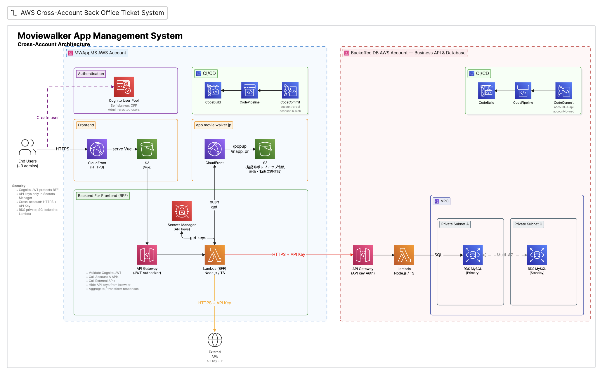
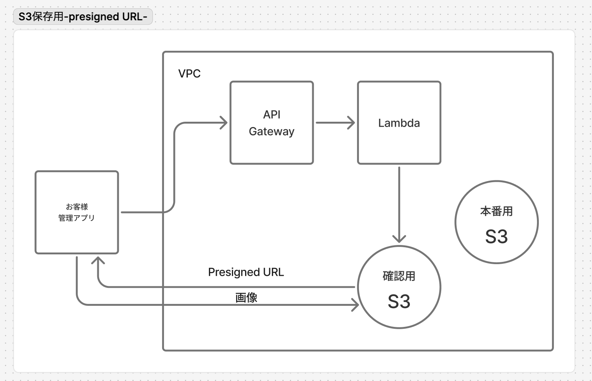
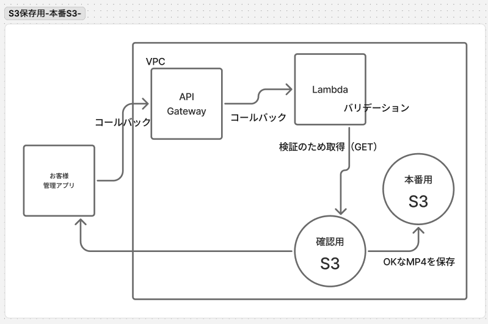
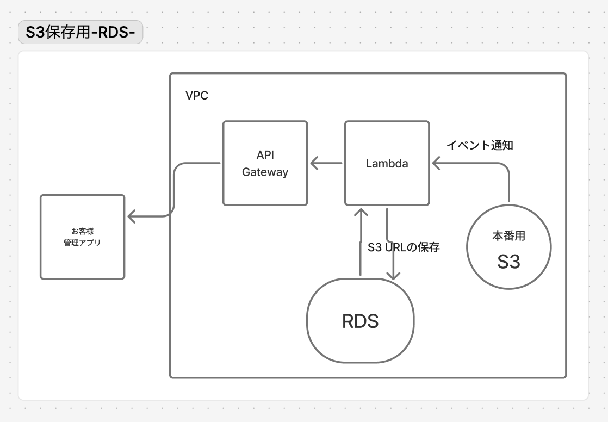

# 要件定義

## 追加実装・変更内容

### 変更内容

#### 映画ログ・表示変更
- 文言の編集
- 検索条件追加
- 検索結果表示変更
- レビュー詳細・編集：項目の変更

### 追加実装
- 画面共通
- 登録時に起動時ポップアップ／画像・動画広告／みたいキャンペーンを選択

#### 画像・動画広告 / みたいキャンペーン / 起動時ポップアップ

上記3機能は同一仕様。各機能ごとに以下を実装する。

- CRUDのAPI追加
- 素材ファイルの自動配置
- DBに保存

### インフラ


#### ネットワーク / 接続要件
- S3 バケットは **確認用S3 / 本番用S3 を別バケットとして分離**（IAM・バケットポリシー・ライフサイクルを個別管理）
- VPC 内 Lambda から各サービスへの到達経路を確保する（RDS をプライベートサブネットに隔離する前提）
  - **S3 Gateway VPCエンドポイント**：VPC内 Lambda から S3（確認用 / 本番用バケット）へアクセスするため（無料）
  - **Secrets Manager Interface VPCエンドポイント**（or NAT Gateway）：`getPool()` が DB認証情報を Secrets Manager から取得するため
- **RDS Proxy**：Lambda 同時実行による RDS コネクション枯渇対策（コネクションプール集約）。`RDS_PROXY_SETUP.md` 参照

### 情報処理


保存ファイルにMP4があるため、データ量が大きい。
API Gateway の 10MB・Lambda の 6MB（同期呼び出しのリクエスト/レスポンス上限）に引っかかるため、「Presigned URL」の使用。
確認用S3に保存（確認用S3と本番用S3は別バケットとして分離）。



S3への保存が完了したら、クライアントが完了通知API（`POST /uploads/complete`）を呼び出すことで Lambda を起動。
Lambda内の「バリデーション」により確認用S3に保存された内容を確認。
チェックが通ったら本番用のS3に保存。
通らなかったら、確認用S3から削除し、レスポンス（400 等）をブラウザに返す。

**バリデーション仕様**（確認用S3 取得後・サーバー側で実施）
- 共通
  - 最大サイズ（種別ごとに上限値を定義。データ量未確定のため具体値は確認中）
  - 拡張子ホワイトリスト（クライアント申告値・補助的）
  - Content-Type ホワイトリスト（クライアント申告値・補助的）
- バイナリ（mp4 / png / jpeg）
  - マジックナンバー検証（＝先頭バイトのシグネチャ。申告 MIME と一致するか）
- テキスト（css / HTML）
  - マジックナンバー無し → サイズ＋拡張子
- ※ Content-Type・拡張子はクライアント申告値のため信用しない。最終判定はサーバー側のバイナリ検証で行う。



本番用S3へ保存したら、そのS3 URL（キー）を RDS Proxy 経由で RDS に保存（RDS Proxy がコネクションプールを集約し、Lambda 同時実行による接続枯渇を防ぐ）

**整合性（S3 と RDS の分散更新）**

S3 と RDS はまたいだトランザクションにできないため、部分失敗に備えて補償処理を行う。
- 本番S3へコピー後に RDS INSERT が失敗した場合 → 本番S3のコピーを削除（補償）し、確認用S3も削除する
- RDS 保存成功後の確認用S3 削除に失敗した場合 → 処理は成功扱いとし、ログに残す（孤児ファイルとして残り得る）
- 孤児ファイル対策として、確認用S3 に **ライフサイクルルール（N日で自動削除）** を設定する
- `/uploads/complete` は**冪等**に設計する（二重呼び出しでレコードが重複しないよう `s3_key` を UNIQUE 等）

### 使用技術
- TypeScript 7系（native preview / tsgo）
- Vue：現行のフロント技術
- Nuet.js：現行のフロント技術
- Express.js：Router
- Swagger UI：APIドキュメント
- Oxlint：リンター
- Oxfmt：フォーマッター
- Vitest：テストコード（※現状未導入・導入予定）
- CDK：インフラ環境構築
- CodeCommit：ソース管理サービス（※CDK未定義・新規提供終了のため要再検討。CodeConnections + GitHub 等を検討）
- AWS CodePipeline：CI／CDツール（※CDK未定義・構想段階）
- serverless-http：Express.jsをサーバーレスにするライブラリ
- Secrets Manager：DB接続情報（RDS認証情報）の取得

#### セキュリティ方針
- IP制限（許可IP帯からのアクセスのみ。固定IP前提）
- VPC（RDS等をプライベートサブネットに隔離）
- 押せるアプリ制限（許可アプリ識別子 / APIキー）
- 認証認可は実装しない（許容するリスクとして以下を明記）
  - 許可IP帯・許可アプリの範囲内では、個人単位の権限制御・本人特定・操作監査は行わない
  - クライアントに埋め込むアプリ識別子 / APIキーは逆コンパイルで抽出され得るため、秘匿性は保証しない
  - したがって本方式は「アクセス元が固定IP（社内NW / VPN）に限定できる」前提で成立する
- **presigned URL による S3 直アップロード経路は API Gateway を通らないため、API Gateway 側の IP制限では保護されない**
  - クライアントは presigned URL で S3 へ直接 PUT するため、API Gateway / WAF の IP制限は当該経路に適用されない
  - presigned URL は有効期限内（現状5分）であれば URL 保有者なら誰でもアップロード可能な bearer 相当
  - 対策：
    - **S3 バケットポリシーで `aws:SourceIp` 条件**を付与し、S3 側でも IP制限する（採用）
    - presigned URL を **PUT ではなく POST + 条件（`content-length-range` / `starts-with`）** とし、アップロード時点でサイズ・プレフィックスを強制する
    - 有効期限は短く保つ（現状5分で妥当）

**`aws:SourceIp` によるS3側IP制限（採用方針）**

presigned URL 経由の直 PUT は API Gateway / WAF を通らないため、確認用S3バケットのバケットポリシーで `aws:SourceIp` を付与し、**許可IP帯（固定IP：社内NW / VPN）以外からの S3 アクセスを拒否**する。
これにより、URL が漏えいしても許可IP外からはアップロードできない。
- 適用対象：確認用S3バケット（直アップロード先）。必要に応じ本番用S3にも適用
- 条件キー：`aws:SourceIp`（許可CIDRのリスト）
- ポリシー例（許可IP帯以外の `s3:*` を Deny）：

```json
{
  "Sid": "DenyIfNotFromAllowedIp",
  "Effect": "Deny",
  "Principal": "*",
  "Action": "s3:*",
  "Resource": [
    "arn:aws:s3:::<確認用バケット>",
    "arn:aws:s3:::<確認用バケット>/*"
  ],
  "Condition": {
    "NotIpAddress": { "aws:SourceIp": ["203.0.113.0/24", "198.51.100.10/32"] }
  }
}
```

- 注意：`aws:SourceIp` は**送信元グローバルIP**で判定するため、許可IPは固定IP前提（要件のセキュリティ方針と整合）。VPC内 Lambda が S3 Gateway VPCエンドポイント経由で同バケットへアクセスする経路を Deny で巻き込まないよう、エンドポイント経由は `aws:SourceVpce` 等で除外する

#### アップロード方式の比較（S3 Presigned URL ／ CloudFront署名付きURL + OAC）

大容量ファイルの直アップロードには2つの方式がある。
**両者は併用不可**（S3 Presigned URL と OAC を同時に使うと `Only one auth mechanism allowed` エラー）。
現状は **S3 Presigned URL 方式** を採用。

- 現状：`[クライアント] --直PUT(presigned URL)--> [確認用S3]`（**API GW を通らない**）
- 記事方式：`[クライアント] --署名付きURL--> [CloudFront] --OAC(SigV4)--> [S3]`（**全リクエストが CloudFront を通る**）

| 観点 | 現状：S3 Presigned URL | CloudFront署名付きURL + OAC |
|---|---|---|
| アップロード経路の保護 | ⚠️ API GW を通らない（上記課題）。WAF/IP制限が効かない | ✅ 全リクエストが CloudFront を通る。WAF/IP制限/DDoS対策が効く |
| IP制限の実現方法 | S3 バケットポリシーの `aws:SourceIp` で別途担保 | CloudFront + WAF で一元化 |
| S3への直アクセス遮断 | バケットポリシーで制御 | ✅ OAC で「CloudFront経由のみ」を強制 |
| 構成のシンプルさ | ✅ CloudFront 不要・部品が少ない | ⚠️ CloudFront + キーグループ + OAC が増える |
| 有効期限・bearer問題 | URL 保有者なら誰でも PUT 可（現状5分） | 署名付きURLも同性質だが、CloudFront層でWAF等を重ねられる |
| マルチパートアップロード | presigned URL + マルチパート | OAC で `READ/WRITE`、`ALL_VIEWER_EXCEPT_HOST_HEADER` が必要 |
| コスト | ✅ 安い | CloudFront 転送料が乗る |

**評価**：

上記セキュリティ方針（固定IP・社内NW/VPN前提、認証認可なし）では、S3 バケットポリシーの `aws:SourceIp` で要件を満たせるため、現状の S3 Presigned URL 方式を継続。

**CloudFront署名付きURL + OAC 方式の採否は、データ量の確認が取れてから判断する。**
- 同方式は全リクエストが CloudFront を経由するため、**転送データ量に応じて CloudFront のデータ転送料が発生**する。mp4 を含む大容量・大量配信になるとコストが無視できない。
- 一方でアップロード/配信のデータ量が小さければ、得られる追加保護（WAF/IP制限の一元化・DDoS対策）に対してコスト影響は軽微。
- したがって「保存ファイル仕様（データサイズ・ファイル形式・枚数）」と非機能要件の「アップロード最大ファイルサイズ」「想定データ件数 / 保存容量」が確定した段階で、**コスト試算 vs セキュリティ便益**を比較して採否を決める。
- それまでは S3 Presigned URL + `aws:SourceIp` 方式で要件を満たす。将来 IP制限を緩める／公開範囲を広げる場合も、API GW を通らない弱点が構造的に解消される本方式への移行を併せて検討する。

参考：https://dev.classmethod.jp/articles/cloudfront-s3-signature-oac-comparison/

#### APIエンドポイント一覧（例）

| メソッド | パス | 概要 | 認可 |
|---|---|---|---|
| GET | `/ads` | 画像・動画広告 一覧 | IP / アプリ制限 |
| GET | `/ads/{id}` | 画像・動画広告 詳細 | 〃 |
| POST | `/ads` | 画像・動画広告 作成 | 〃 |
| PUT | `/ads/{id}` | 画像・動画広告 更新 | 〃 |
| DELETE | `/ads/{id}` | 画像・動画広告 削除（物理削除） | 〃 |
| GET | `/campaigns` | みたいキャンペーン 一覧 | 〃 |
| GET | `/campaigns/{id}` | みたいキャンペーン 詳細 | 〃 |
| POST | `/campaigns` | みたいキャンペーン 作成 | 〃 |
| PUT | `/campaigns/{id}` | みたいキャンペーン 更新 | 〃 |
| DELETE | `/campaigns/{id}` | みたいキャンペーン 削除（物理削除） | 〃 |
| GET | `/popups` | 起動時ポップアップ 一覧 | 〃 |
| GET | `/popups/{id}` | 起動時ポップアップ 詳細 | 〃 |
| POST | `/popups` | 起動時ポップアップ 作成 | 〃 |
| PUT | `/popups/{id}` | 起動時ポップアップ 更新 | 〃 |
| DELETE | `/popups/{id}` | 起動時ポップアップ 削除（物理削除） | 〃 |
| POST | `/uploads/presign` | 一時領域へ presigned URL 発行 | 〃 |
| POST | `/uploads/complete` | アップロード完了通知＋検証＋本番移送 | 〃 |

※ POST/PUT のリクエストボディ、レスポンス形（200 / 400 / 404 / 500）は各エンドポイントで別途定義する。

#### RDSスキーマ

テーブル名のみ確定。**各カラムは確認中。**

| テーブル名 | 用途 | カラム |
|---|---|---|
| **M_PR_INFO** | 画像・動画広告 | 確認中 |
| （確認中） | みたいキャンペーン | 確認中 |
| **M_POPUP_MESSAGE** | 起動時ポップアップ | 確認中 |
| （確認中） | アップロード素材管理（S3キー） | 確認中 |


#### 保存ファイル仕様

確認中の内容

- データサイズ
- ファイル形式
- 枚数

**動画**
- mp4

**画像**
- png
- jpeg
- jpg

**その他**
- css
- HTML

### 非機能要件

※ 数値・方針が未確定の項目が多いため、まず型のみ定義する。確定し次第「目標 / 方針」を埋める。

| カテゴリ | 項目 | 目標 / 方針 | 状態 |
|---|---|---|---|
| 性能 | API レスポンスタイム（例：p95） | | 確認中 |
| 性能 | アップロード最大ファイルサイズ（種別別） | データ量確定後に定義 | 確認中 |
| スケーラビリティ | 想定同時アクセス数 / Lambda 同時実行数 | RDS Proxy 前提で定義 | 確認中 |
| スケーラビリティ | 想定データ件数 / 保存容量 | | 確認中 |
| 可用性 | 目標稼働率 / 障害時の挙動 | | 確認中 |
| 一覧API | ページネーション方式（limit/offset or cursor） | 件数増に備えて必須 | 確認中 |
| Lambda | メモリ / タイムアウト見積り | 検証内容（マジックナンバー検証・マルチパート）に応じて再見積り | 確認中 |
| セキュリティ | CORS（S3 直PUT 用のバケット CORS 設定を含む） | | 確認中 |
| 運用 | ログ / 監視 / アラート | 構造化ログ（実装済）＋ CloudWatch アラーム | 確認中 |
| 運用 | バックアップ / リテンション（RDS・S3） | | 確認中 |
| コスト | 月額想定 | | 確認中 |

### より大きいデータの場合

- presigned URL ＋　マルチパートアップロード

大きいファイルを分割してS3に保存する方法。

