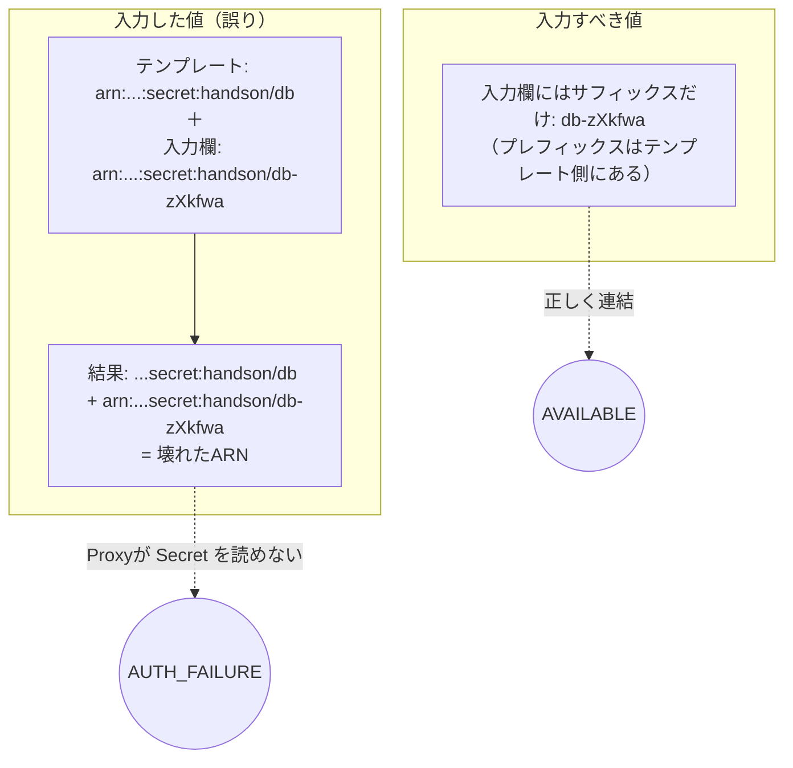

# 接続トラブル振り返りと学び（1枚まとめ）

`クライアント → API Gateway → Lambda(VPC内) → RDS Proxy → RDS` が **200 で通るまで**に
詰まった4つの原因と、**実装者が今後気をつける観点**を1枚にまとめる。

> 結論：`GET /users → 200` `[{"id":1,"name":"alice"},{"id":2,"name":"bob"},{"id":3,"name":"carol"}]`
> 全経路が開通し、移行した3件が返った。

---

## 1. 全体像 ― どこで何が詰まっていたか

```mermaid
flowchart LR
    User[クライアント / curl] -->|HTTPS| APIGW[API Gateway]
    APIGW -->|プロキシ統合| Lambda[Lambda<br/>Express + serverless-http]
    Lambda -->|MySQL 3306| Proxy[RDS Proxy]
    Proxy -->|MySQL 3306| RDS[(RDS MySQL8<br/>DB: handson)]

    Lambda -.->|実行ロールで取得| Secret[Secrets Manager<br/>handson/db]
    Proxy  -.->|IAMロールで取得| Secret

    %% 詰まっていた箇所
    Lambda -. 原因1 コードがローカル前提 .-> X1((✗))
    Secret -. 原因2 hostが127.0.0.1 .-> X2((✗))
    RDS    -. 原因3 PWがSecretと不一致 .-> X3((✗))
    Proxy  -. 原因4 IAMのARN二重連結 .-> X4((✗))
```

| # | 詰まった場所 | 症状 | 直した内容 |
|---|---|---|---|
| 1 | Lambda コード | `fromIni` が即エラー | `AWS_LAMBDA_FUNCTION_NAME` で分岐し、Lambda上は実行ロールを使用。**再デプロイ** |
| 2 | Secret `handson/db` | host が `127.0.0.1` | Proxy エンドポイントに修正＋`username: root` 追加 |
| 3 | RDS マスターPW | Secret と不一致 → ログイン不可 | password をリセット。`root` を `mysql_native_password` に変更 |
| 4 | RDS Proxy の IAMポリシー | Secret 読めず `AUTH_FAILURE` | **二重連結した ARN** を正しい ARN に修正 → ターゲット `AVAILABLE` |

---

## 2. 一番の決定打 ― 原因4のARN二重連結

「テンプレート変数」欄に **フルARN** を貼ったため、テンプレート側のプレフィックスと重複した。



> **教訓**：`secretArn` / `kmsKeyId` の入力欄は、**テンプレート側にプレフィックスが入っている**。
> 貼るのは **サフィックス部分だけ** が正解。

---

## 3. 実装者が今後気をつける観点（本題）

「何が漏れていたか → どう確認するか → どんな観点を持つか」をセットで残す。

### 漏れ① デプロイしたつもりが反映されていない
- **何が漏れていたか**：`cdk deploy` が「変更なし」で、コード修正が載っていなかった。
- **確認方法**：
  ```bash
  aws lambda get-function --function-name lambda-express-api \
    --query 'Configuration.LastModified'
  # デプロイ直後の時刻になっているか
  ```
  CDK出力の `X resources / no changes` を必ず読む。コード変更が `bundling` で拾われたかログを見る。
- **観点**：**「コマンドを打った」≠「反映された」**。実行後は必ず**結果（差分・更新時刻）を観測**してから次へ進む。

### 漏れ② 接続先・認証情報が複数箇所に重複している
- **何が漏れていたか**：host/username/password が **Secret・RDS本体・Proxy** の3箇所にまたがり、それぞれズレていた（127.0.0.1 のまま、PW不一致）。
- **確認方法**：
  ```bash
  # Secret の中身を確認（host が Proxy エンドポイントか）
  aws secretsmanager get-secret-value --secret-id handson/db \
    --query SecretString --output text | jq '{host,username}'
  # 直結で認証情報が正しいか切り分け
  mysql -h <proxy-endpoint> -u root -p
  ```
- **観点**：**「設定値の単一の真実（Single Source of Truth）はどこか」を最初に決める**。
  同じ値が複数箇所にある時は、**1箇所ずつ突き合わせて一致を確認**する。

### 漏れ③ エラーを「経路のどの区間か」で切り分けていなかった
- **何が漏れていたか**：`AUTH_FAILURE` を見て Lambda 側を疑ったが、実際は **Proxy→Secret** の区間だった。
- **確認方法**：経路を**区間ごとに独立して**潰す。
  - クライアント→APIGW：`curl` で 200/4xx/5xx を見る
  - Lambda→Proxy：**RDS Proxy のターゲットが `AVAILABLE` か**（ここが今回の鍵）
    ```bash
    aws rds describe-db-proxy-targets --db-proxy-name <name> \
      --query 'Targets[].TargetHealth'
    ```
  - Lambda 実行ログ：CloudWatch の `getSecret.failed` / `getPool.failed` を見る
- **観点**：**多段構成は「区間ごとに切り分ける」**。一気に端から端を疑わず、
  **健全な区間とNGな区間の境界**を特定してから原因を読む。

### 漏れ④ GUI で直した変更が CDK 管理外になっている
- **何が漏れていたか**：Lambda のサブネット・SG を **マネジメントコンソールで手修正**した。CDK には書かれていない。
- **確認方法**：
  ```bash
  npx cdk diff   # 手修正と CDK 定義の差分が出る＝管理外の変更がある証拠
  ```
- **観点**：**手で直したら、次の `cdk deploy` で巻き戻る（ドリフト）**。
  応急処置はGUIで良いが、**動いたら必ずコード（CDK）に反映**して恒久化する。

### 観点まとめ（チェックリスト）

| 観点 | ひとことで |
|---|---|
| 反映の確認 | 「打った」で満足せず「**変わった**」を観測する |
| 設定の真実 | 同じ値が複数箇所 → **SSoT を決めて突き合わせる** |
| 区間切り分け | 多段は**端から端を一気に疑わない**。境界を特定 |
| ドリフト防止 | GUI修正は応急。動いたら**CDKに戻す** |
| ログ設計 | 失敗箇所が**ログだけで区間特定できる**か（今回 `getSecret.failed` 等が有効だった） |

---

## 4. 後片付け（任意・推奨）

動作後に残った「一時的な穴」と「管理外」を閉じる。

- [ ] RDS のパブリックアクセス OFF ＋ SG の `118.156.20.141/32 : 3306`（データ投入用の一時穴）を削除。Proxy経由で繋がるので不要。
- [ ] Lambda のサブネットをプライベート2つに統一（現状 `subnet-0de1…(public-1a)` + `subnet-0c6a…(private-1c)` の混在）。CDK に `vpc / vpcSubnets / securityGroups` を追記して管理下へ。
- [ ] `index.ts` の `profile: 'mvtk-refactoring'` → 自分のローカルプロファイル（例 `mw-loadoff`）に直すとローカルでも動く。
- [ ] `index.ts` のコード修正をコミット。

> いずれも「今動いている状態を、**コード管理された再現可能な状態**にする」ための作業。
