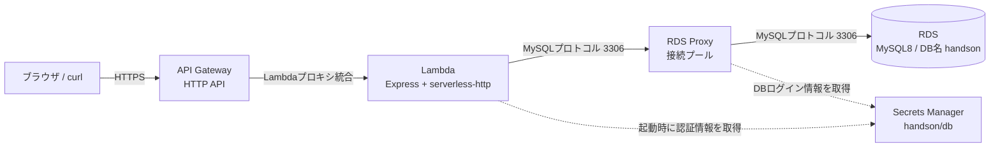
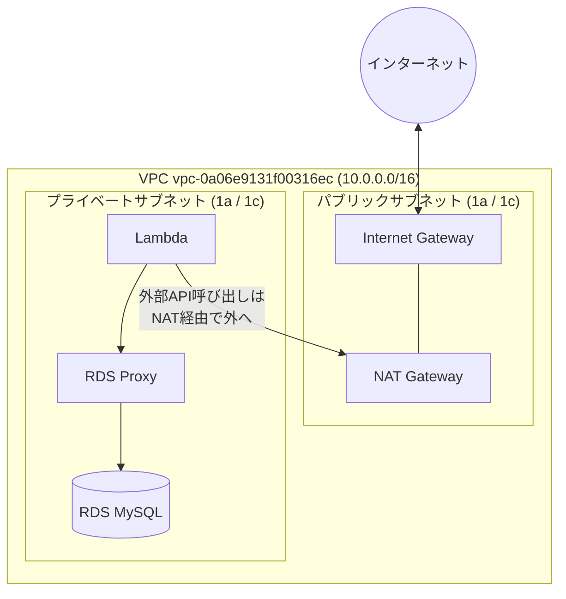
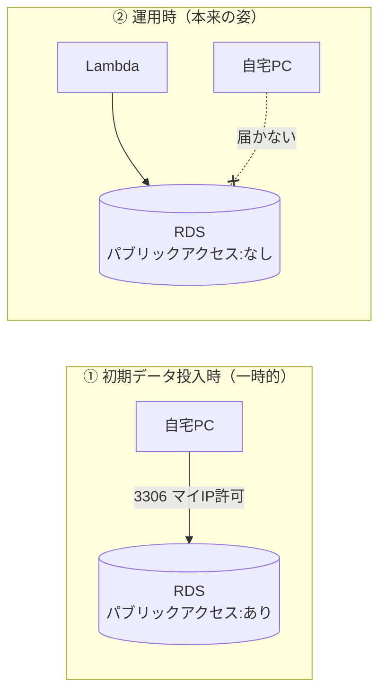
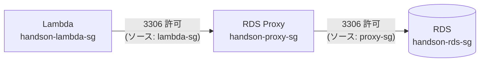
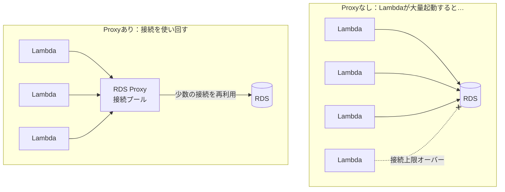
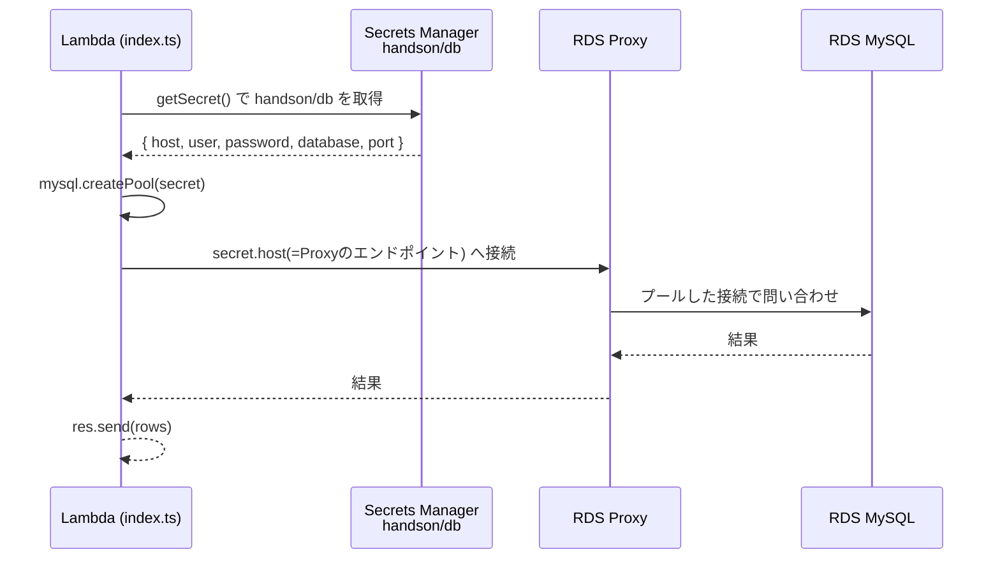
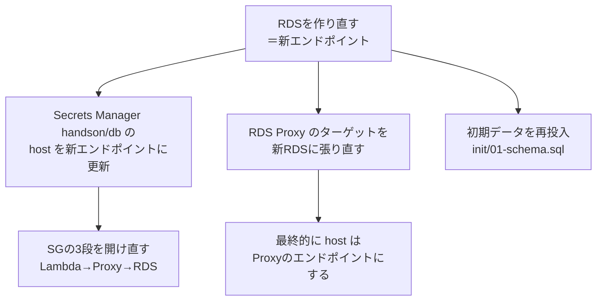

# 構成のつながり図解（なぜこう繋ぐのか）

RDS を作るときに設定する VPC・サブネット・セキュリティグループ・Secrets Manager が、
**他のサービスとどう繋がり、なぜ繋ぐのか**を Mermaid 図で解説する。

対象構成：`ブラウザ → API Gateway → Lambda(Express) → RDS Proxy → RDS(MySQL)`

---

## 1. 全体像（リクエストの流れ）

ユーザーが `/users` を叩いてから DB に届くまでの一本道。



**なぜこの順番か**
- **API Gateway** … インターネットに公開する「玄関」。Lambda は単体では URL を持たないので、HTTP の受け口が必要。
- **Lambda** … Express アプリ本体。`serverless-http` で Express を Lambda 化している（`index.ts:220`）。
- **RDS Proxy** … Lambda と RDS の間で **DB接続を使い回す**係。理由は §4。
- **RDS** … データ本体（`users` テーブル）。
- **Secrets Manager** … DBの接続情報（host/user/password）を**コードに書かず**に渡す金庫。理由は §5。

---

## 2. ネットワークの箱（VPC とサブネット）— RDS 設定の「接続」欄の正体

RDS 作成時に選ぶ **VPC / サブネットグループ / パブリックアクセス** は、この「箱の中のどこに置くか」を決めている。



**なぜプライベートサブネットに置くのか**
- RDS / Proxy / Lambda は**インターネットから直接触られたくない**ので、出口が NAT Gateway だけの
  プライベートサブネットに置く（外から中へは入れない＝安全）。
- ただし Lambda は Secrets Manager（AWSのパブリックAPI）を呼ぶ必要があるため、
  **中から外へは NAT Gateway 経由**で出られる構成にしている。

**「パブリックアクセス：あり/なし」の意味**
- `あり` … RDS をパブリックサブネット側に置き、自宅PCから直接 3306 で繋げる状態。
  → **初期データ投入のときだけ**使う一時的な状態（`AWS_DEPLOY.md` ステップ2）。
- `なし` … プライベートに閉じる本来の状態。Lambda 経由でしか届かない（ステップ9で締める）。



---

## 3. セキュリティグループ — 「誰が誰に 3306 で話してよいか」の許可リスト

サブネットが「どの部屋に置くか」なら、セキュリティグループ(SG)は「**部屋のドアを誰に開けるか**」。
通信は **Lambda SG → Proxy SG → RDS SG** の3段で、各ドアを順に開けないと繋がらない。



**なぜ SG を「相手の SG」で指定するのか**
- IP アドレスは Lambda のスケールで変わるので、**「この SG を持つ相手なら通す」**という指定にする。
- RDS SG のインバウンドに「ソース = Proxy SG」を入れる＝**Proxy からの 3306 だけ通す**。
  それ以外（インターネットや無関係なリソース）は全部弾く。

| SG | インバウンドで許可する相手 | 意味 |
|----|--------------------------|------|
| `handson-proxy-sg` | Lambda SG からの 3306 | Lambda だけが Proxy に話せる |
| `handson-rds-sg` | Proxy SG からの 3306 | Proxy だけが RDS に話せる |
| （投入時のみ）`handson-rds-sg` | マイIP からの 3306 | 自宅PCから初期投入する間だけ |

> ⚠️ 3段のどれか1つでも開け忘れると「繋がらない」。トラブルの典型原因。

---

## 4. なぜ RDS Proxy を挟むのか（直接繋がない理由）



- Lambda は同時に何百個も起動しうる。各々が DB 接続を張ると **RDS の接続数上限が枯渇**する。
- RDS Proxy が接続を**プール（使い回し）**することで、少数の接続で大量の Lambda をさばける。
- このため **アプリの接続先は RDS 直ではなく Proxy のエンドポイント**になる。
  RDS のエンドポイントは「Proxy 作成時のターゲット指定」にだけ使う（`RDS_PROXY_SETUP.md` ステップ1）。

---

## 5. Secrets Manager — 接続情報をコードに書かない仕組み

`index.ts` は DB の host/user/password を**コードに持たず**、起動時に Secrets Manager から取得している。



**ポイント（コードとの対応）**
- `getSecret()` … `SecretId: 'handson/db'` を取得（`index.ts:29-36`）。シークレット名は**コードと完全一致**が必須。
- `getPool()` … 取得した JSON をそのまま `mysql.createPool()` に渡す（`index.ts:38-43`）。
  → だから **シークレットのキーは mysql の設定キー**（host/user/password/database/port）にする。
- **接続先を Proxy に変える方法** … コードは触らず、シークレットの `host` を
  「RDSエンドポイント」→「Proxyエンドポイント」に書き換えるだけ（`RDS_PROXY_SETUP.md` ステップ6-2）。

**`user` と `username` の罠**
- アプリ(mysql2)は `user` キーを使う。
- RDS Proxy は `username` キーで DB ログインする。
- そのため `handson/db` には**両方**入れておく（`RDS_PROXY_SETUP.md` ステップ3）。

```json
{
  "host": "<Proxyのエンドポイント>",
  "port": 3306,
  "user": "root",        // ← アプリ(mysql2)が使う
  "username": "root",    // ← RDS Proxy が使う
  "password": "password",
  "database": "handson"
}
```

---

## 6. RDS 作成設定が「どこに効くか」早見表

作成画面で入れる値が、上のどの図につながるかの対応。

| RDS作成時の設定 | つながる相手 | なぜ必要か |
|----------------|------------|-----------|
| エンジン MySQL8 | アプリ(mysql2) / docker-compose | ローカルの `mysql:8` と合わせる |
| VPC `vpc-0a06...` | Lambda・Proxy と同じ箱 | 同じVPC内でないと private 通信できない（§2） |
| サブネットグループ | プライベート/パブリックの配置 | どこに置くか＝誰から届くか（§2） |
| パブリックアクセス | 自宅PC / Lambda | `あり`=投入時だけ / `なし`=運用（§2） |
| SG `handson-rds-sg` | Proxy SG | Proxy からの 3306 だけ通す（§3） |
| 最初のDB名 `handson` | アプリの `database` 設定 | 入れ忘れると空DB＝接続先が無い |
| マスターユーザー/パスワード | Secrets Manager の値 | シークレットの user/password と一致させる（§5） |

---

## 7. 作り直したら必ず直すもの（依存の連鎖）

RDS を作り直すと**エンドポイントが変わる**。下流が芋づる式に影響するので順に直す。



- ❗ いちばん忘れやすいのは **Secrets Manager の `host` 更新**。
  ここが古いままだと Lambda が存在しないホストに繋ぎにいって落ちる。
- Proxy を使う最終形では `host` は **Proxy のエンドポイント**にする（RDS直ではない）。

---

## 関連ドキュメント
- `AWS_DEPLOY.md` … Lambda + API Gateway + RDS の全デプロイ手順
- `RDS_データ投入手順.md` … 空のRDSにスキーマ/初期データを流す手順
- `RDS_PROXY_SETUP.md` … RDS Proxy の作成と接続切替
- `index.ts` … Secrets Manager 取得とコネクションプールの実装
